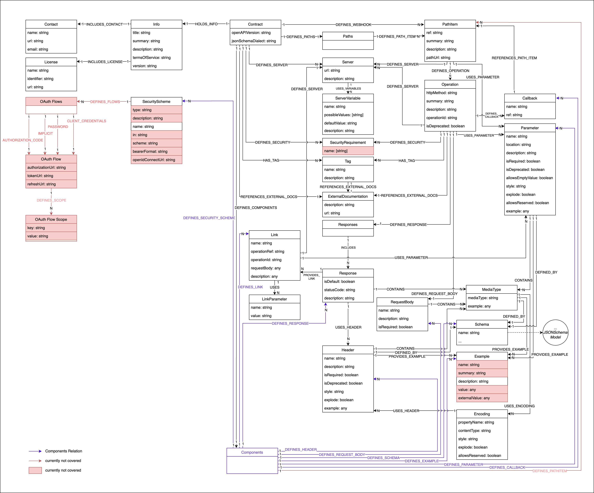
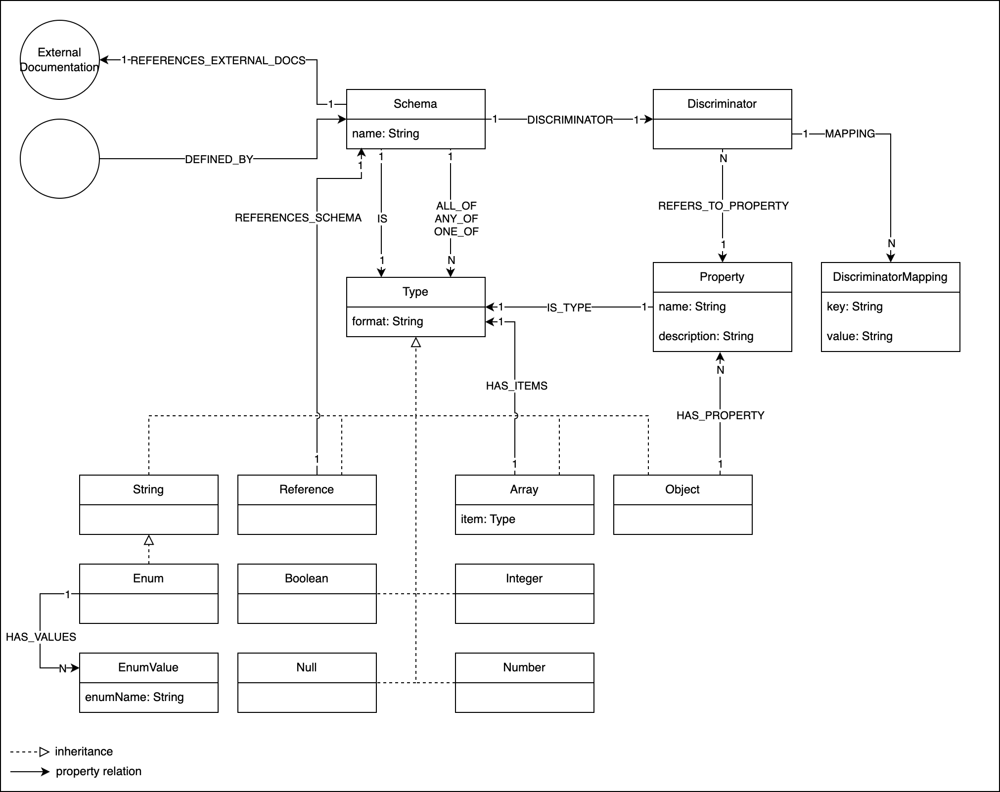

= jQAssistant OpenAPI Plugin

This is the OpenAPI Plugin for https://jqassistant.org[jQAssistant].
It provides a scanner for https://www.openapis.org/[OpenAPI] Contract files.

For more information on jQAssistant see https://jqassistant.org[^].

== Usage

Build your jQAssistant local.

Add the plugin to the plugins section of the `.jqassistant.yml` configuration file:

[source,yaml]
..jqassistant.yml
---- 
jqassistant:
  plugins:
    - group-id: org.jqassistant.plugin
      artifact-id: jqassistant-openapi-plugin
      version: 2.0.0-SNAPSHOT
  scan:
    include:
      files:
        -relativ to path or absolute path to openapi.yml
----

==== How to run

Windows: jqassistant.bat scan 

Unix: jqassistant.sh scan

== Model

=== Contract

=== Schema

// == Use Cases

== Supported Versions

Tested with OpenAPI Version 3.0 and 3.1
