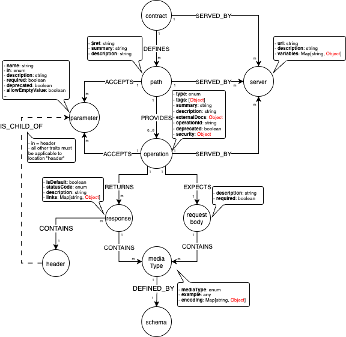
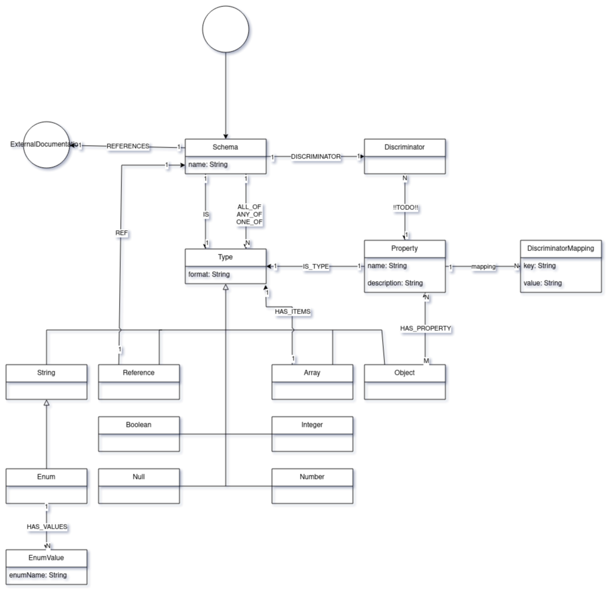

= jQAssistant OpenAPI Plugin

This is the OpenAPI Plugin for https://jqassistant.org[jQAssistant].
It provides a scanner for https://www.openapis.org/[OpenAPI] Contract files.

For more information on jQAssistant see https://jqassistant.org[^].

== Usage

Add the plugin to the plugins section of the `.jqassistant.yml` configuration file:

[source,yaml]
..jqassistant.yml
----
TODO!
----

TODO: How to excecute

== Model

=== Contract

=== Schema

== Use Cases

== Supported Versions

Tested with OpenAPI Version TODO!
== Changelog

TBD
