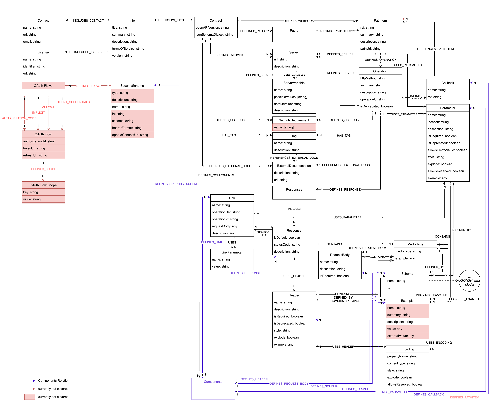
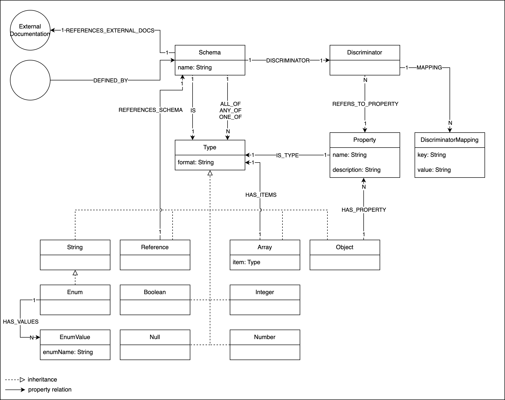

= jQAssistant OpenAPI Plugin

This is the OpenAPI Plugin for https://jqassistant.org[jQAssistant].
It provides a scanner for https://www.openapis.org/[OpenAPI] Contract files.

For more information on jQAssistant see https://jqassistant.org[^].

== Usage

To be able to use the plug-in, it must be specified as a plug-in to jQAssistant.
Additionally, it must be configured as a scan-include where jQAssistant can find the OpenAPI-contracts.

[source,yaml]
..jqassistant.yml
---- 
jqassistant:
  plugins:
    - group-id: org.jqassistant.plugin <1>
      artifact-id: jqassistant-openapi-plugin
      version: 2.0.0-SNAPSHOT
  scan:
    include:
      files:
        -openapi:contract::${project.basedir}/path/to/api.yml <2>
----
<1> Dependency to the OpenAPI plugin
<2> Scan include of the OpenAPI contract

== Model

=== Contract

=== Schema

== Supported OpenAPI Versions

Tested with OpenAPI Version 3.0 and 3.1
